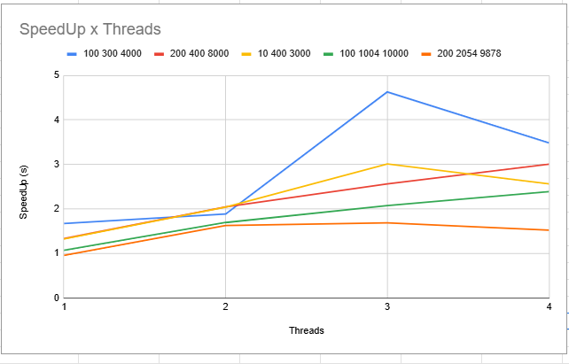

# Função Zeta de Riemann

## Universidade Presbiteriana Mackenzie  
**Faculdade de Computação e Informática**

## 📘 Introdução

Este projeto tem como objetivo aplicar técnicas de computação paralela na busca por zeros da função Zeta de Riemann no eixo crítico. Foram desenvolvidas duas versões do algoritmo: uma **sequencial** e outra **paralela**, com o intuito de comparar desempenho e escalabilidade.

---

## Como usar o código

### 🔧 Requisitos
Antes de compilar e executar o código, verifique se você tem os seguintes requisitos instalados:

- [GCC](https://gcc.gnu.org/) com suporte a OpenMP
- Sistema Linux, WSL ou terminal com compilador compatível
- Make (opcional, se usar um Makefile)

### 🧪 Compilando o código

Primeiramente, vá até a pasta dos códigos baixados.
```bash
cd [nome_da_pasta]
```

Para compilar a versão **sequencial**:

```bash
gcc -fopenmp -o serial serial.c -lm
```

Para compilar a versão **paralela**:
```bash
gcc -fopenmp -o paralela paralela.c -lm
```

Para mudar a quantidade de Threads na versão **paralela**:
vá até a função int main() e altere:
```bash
omp_set_num_threads(1); //altere a quantidade de threads
```
---

## ⚙️ Descrição

O programa realiza uma modelagem computacional da função Zeta de Riemann, calculando os valores da função Z(t) em um intervalo contínuo. A partir da análise da mudança de sinais, é possível localizar os zeros da função. 

A solução foi implementada em duas versões:

### 🔹 Solução Serial

Na versão sequencial, todos os cálculos são feitos em uma única thread. O algoritmo percorre o intervalo de forma contínua, verificando alterações de sinal na função Z(t) para contar os zeros. Essa abordagem é simples e garante resultados consistentes.

### 🔸 Solução Paralela

A versão paralela utiliza OpenMP para dividir o trabalho entre múltiplas threads. O cálculo de Z(t) é feito de forma independente por cada thread, utilizando `#pragma omp parallel for schedule(static)`. Como os valores são independentes, a paralelização melhora significativamente o desempenho. A contagem dos zeros, no entanto, é realizada de forma sequencial após o cálculo paralelo.

---

## 📊 Tabela de Testes

| Teste              | Threads | Serial (s) | Paralelo (s) | SpeedUp | Eficiência |
|--------------------|---------|------------|---------------|---------|------------|
| 100 300 4000       | 1       | 8.898      | 5.321         | 1.67    | 1.67       |
|                    | 2       | 8.898      | 4.724         | 1.88    | 0.94       |
|                    | 3       | 8.898      | 1.922         | 4.63    | 1.54       |
|                    | 4       | 8.898      | 2.556         | 3.48    | 0.87       |
| 200 400 8000       | 1       | 13.950     | 10.486        | 1.33    | 1.33       |
|                    | 2       | 13.950     | 6.822         | 2.04    | 1.02       |
|                    | 3       | 13.950     | 5.444         | 2.56    | 0.85       |
|                    | 4       | 13.950     | 4.642         | 3.00    | 0.75       |
| 10 400 3000        | 1       | 8.351      | 6.312         | 1.32    | 1.32       |
|                    | 2       | 8.351      | 4.099         | 2.04    | 1.02       |
|                    | 3       | 8.351      | 2.775         | 3.01    | 1.00       |
|                    | 4       | 8.351      | 3.262         | 2.56    | 0.64       |
| 100 1004 10000     | 1       | 56.345     | 52.694        | 1.07    | 1.07       |
|                    | 2       | 56.345     | 33.269        | 1.69    | 0.85       |
|                    | 3       | 56.345     | 27.169        | 2.07    | 0.69       |
|                    | 4       | 56.345     | 23.577        | 2.39    | 0.60       |
| 200 2054 9878      | 1       | 116.531    | 122.008       | 0.96    | 0.96       |
|                    | 2       | 116.531    | 71.709        | 1.63    | 0.81       |
|                    | 3       | 116.531    | 69.055        | 1.69    | 0.56       |
|                    | 4       | 116.531    | 76.525        | 1.52    | 0.38       |

---

## 📈 Gráficos

Gráficos de **SpeedUp** e **Eficiência** foram gerados com base nos testes acima. Eles evidenciam o comportamento da paralelização com o aumento do número de threads.

### SpeedUp por número de threads




### Eficiência por número de threads


---

## 🧠 Conclusão

De maneira geral, observa-se que o uso de múltiplas threads proporciona ganhos de desempenho significativos, especialmente nos testes com menor carga computacional, como o caso `100 300 4000`, que apresentou um *speedup* de até 3,48 ao utilizar 4 threads. No entanto, o ganho de desempenho não cresce de forma linear com o número de threads — o que seria o cenário ideal —, evidenciando a presença de sobrecarga associada à criação, sincronização e gerenciamento de threads.

À medida que o número de threads aumenta, a eficiência tende a diminuir, pois parte do tempo de execução é consumida em tarefas de coordenação entre as threads em vez de processamento útil. Isso fica evidente nos testes de maior porte, como `200 2054 9878`, em que a eficiência com 4 threads caiu para apenas 0,38, demonstrando que o custo da paralelização pode superar seus benefícios dependendo do tamanho e da natureza da tarefa.

Outro ponto importante é que diferentes testes reagem de forma distinta à paralelização. Enquanto alguns escalonam bem com o aumento de threads, outros apresentam ganhos mais limitados. Isso indica que o desempenho paralelo está fortemente ligado às características do problema, como a divisão equilibrada de tarefas e a quantidade de cálculos independentes que podem ser realizados simultaneamente.

Em síntese, a paralelização da função Zeta de Riemann pode trazer vantagens claras, mas seu benefício depende do equilíbrio entre o custo de paralelização e o ganho de desempenho. O número ideal de threads varia conforme o tamanho do problema, sendo que, para muitos casos, o uso de 3 threads oferece um bom compromisso entre desempenho e eficiência, enquanto o uso excessivo de threads pode gerar perda de desempenho devido ao overhead.

---

## 🔗 Referências

- [OpenMP Specifications](https://www.openmp.org/specifications/)
- [arXiv: Zeta Function and Computation](https://arxiv.org/abs/2003.11069)
